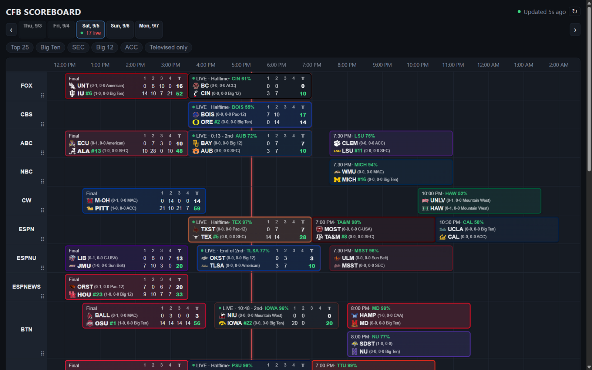

# CFB Scoreboard

A college football scoreboard with a TV-guide layout: channels are rows, time runs left-to-right, and each game is a block spanning its kickoff-to-final window on the channel that broadcast it.

**Try it live: <https://suppressor72.github.io/cfb-scoreboard/>**



## Features

- **TV-guide grid** — one row-group per channel (ABC, ESPN, FOX, BTN, ...), games positioned by start time at a fixed hour-to-row aspect. Concurrent games on a channel stack into packed lanes instead of overlapping, and the whole day fits without horizontal scrolling.
- **Quarter-by-quarter scores** — each block carries an ESPN-style linescore (per-quarter points plus a bold T column) once play begins; the details popup adds the full table.
- **Win probability** — ESPN Analytics matchup predictor before kickoff and live win probability during games, shown for the favored team and refreshed on a slow cadence.
- **Team marks and records** — logos (dark-background variants), rank, overall/conference record, and conference next to each team.
- **Streaming rows** — ESPN+, Disney+, Peacock, B1G+, etc. get their own row-groups; non-televised games group in an "Other" row at the bottom.
- **Drag-to-reorder channels** — grab the handle on any rail; the custom sequence persists across sessions.
- **Day tabs** — a seven-day window (Thursday→Wednesday) defaulting to today, with previous/next week navigation; gameless days hide their tab.
- **Filters** — Top 25 and conference chips are additive (union); "Televised only" restricts. Persisted locally.
- **Game details** — popup at the click point with linescore, betting line (spread/OU when published), broadcasts, venue, records, and the ESPN gamecast link.
- **Live scores** — scheduler-driven polling (30s live / 2min pending / 15min settled) with stale/error states that keep the last good data visible.
- **Responsive** — compact card list on phones; UI scales up 1.2x/1.5x on large monitors.

## Data

Scores and broadcast info come from ESPN's free public scoreboard API (no key, CORS-open — verified empirically; see [docs/DATA.md](docs/DATA.md)). `scripts/probe_espn.py` regenerates the evidence.

## Tech Stack

- React 18 + Vite + TypeScript
- Deployed as a static site on GitHub Pages (no backend; a gateway is a documented deferred option, not part of v1)

## Project Layout

- `AGENTS.md` — guidance and hard rules for AI coding agents working here
- `docs/SPEC.md` — UI/layout specification
- `docs/DATA.md` — data source details, field mapping, refresh/error policy, provider contract
- `docs/ARCHITECTURE_ASSESSMENT.md` — external architecture assessment (A1–A13)
- `docs/ADVERSARIAL_REVIEW.md` — external spec review (F1–F7)
- `docs/REVIEW_RESPONSE.md` — disposition of every review finding
- `docs/screenshot.png` — README screenshot
- `scripts/probe_espn.py` — ESPN API verification probe
- `src/` — application code (`api` provider/adapter/predictor, `lib` date/color/display utils, `selectors` pure logic, `state` store/scheduler/predictor cache, `components` UI)
- `tests/` — vitest suites with sanitized ESPN fixtures

## Development

```bash
npm install
npm run dev
```

Other scripts: `npm test`, `npm run typecheck`, `npm run build`, `npm run preview`. CI runs typecheck + tests + build on every push and PR; a green CI run on main deploys the build to GitHub Pages and smoke-tests the live site.

## Status

Implemented and deployed — 80 tests, typecheck, and production build green in CI; live at the link above.
