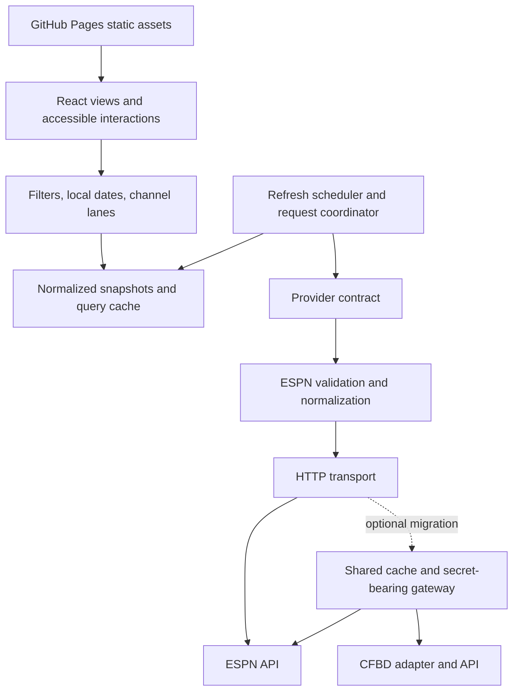

# Architecture assessment

Assessed: 2026-09-05. Status: recommendations, not an implemented design.

## Verdict

React, Vite, TypeScript, and static hosting are a reasonable foundation for this
read-only scoreboard. Keep that foundation for the initial release. The proposed
architecture is not ready for implementation as written: its data contract cannot
express several promised features, and its scheduling, calendar, and layout rules
leave core correctness unresolved.

Browser-to-ESPN access is a conditional deployment choice, not a verified operating
assumption. A provider module is useful, but changing providers can also require
credential storage, different request budgets, and reduced functionality. A small
server-side gateway should be a documented migration option. It is not necessary
to introduce a database, SSR, accounts, or multiple backend services now.

## Scope and evidence

Reviewed [README](../README.md), [UI specification](SPEC.md),
[data specification](DATA.md), and the [earlier review](ADVERSARIAL_REVIEW.md).
References below use the original specifications' line numbers. No source code,
package manifest, deployment configuration, or tests exist in this workspace.
This assesses the entire proposed architecture; it cannot certify an implementation,
performance, security, accessibility, or production availability.

Evidence categories:

- **Confirmed gap:** a requirement conflicts with, or is absent from, the supplied contract.
- **Design risk:** a concrete failure scenario the specification does not address;
  not a claim that unimplemented code already has the defect.
- **External observation:** official documentation or the limited probe below.

The web reader could not retrieve the ESPN endpoint. A local PowerShell request
failed at the connection layer; an approved request outside the sandbox received
an HTML **Access Denied** response from the upstream edge. The requested URL was
[the specified scoreboard endpoint with a date and limit](https://site.api.espn.com/apis/site/v2/sports/football/college-football/scoreboard?dates=20260905&limit=100).
No JSON or successful CORS headers were obtained. This demonstrates failure from
this environment, not a general outage or a browser CORS failure. Payload shape,
date semantics, group coverage, result limits, and end-time availability remain
unverified. No repeated load testing was performed.

## Architecture and responsibility boundaries

Recommended logical structure; boxes inside the browser are modules, not services:

Views should consume normalized objects and freshness/error state. They should
not know ESPN JSON paths, launch independent game requests, or own recurring
timers. Keep filter/date/lane calculations pure and separate from network effects.
Keep source payloads out of the public component contract. UI state includes the
selected date, filters, focused channel, expanded rows, and selected game; remote
state includes snapshots, completeness, freshness, errors, and request ownership.

One query coordinator should own cache writes and scheduling. Use a query-cache
library or a small explicit coordinator, but do not create a second independent
cache/polling system around it. React's documentation identifies race handling,
deduplication, and caching as concerns when fetching in effects.
[React useEffect guidance](https://react.dev/reference/react/useEffect#fetching-data-with-effects).

## Findings and architectural consequences

P1 means resolve before implementing the affected core behavior. P2 means resolve
before release or explicitly accept the constrained behavior. Conditional findings
do not require building unused infrastructure immediately.

### A1 — P1: The domain contract cannot support the specified UI

**Confirmed gap.** DATA lines 76–93 omit actual end time, conference membership,
stable team IDs, records, venue, and gamecast URL. SPEC lines 13, 27–28, and 41–42
require those capabilities. Historical game width cannot be recovered from kickoff
and `post` alone. This consolidates earlier findings F2, F4, and F5.

**Decision:** Expand the contract before building components. Establish the source
and missing-value behavior of every field. Allow an estimated duration explicitly;
do not label the browser's observation time as the actual finish time. Attach
conference membership to a season context and define a selected conference as
matching either competitor. Unknown membership stays unknown.

### A2 — P1: Polling cannot discover games becoming live

**Confirmed gap.** DATA lines 59–62 and SPEC lines 60–63 poll only existing live
games. A page opened before kickoff has no trigger to discover live play. A
60-second freshness check can also absorb nominal 30-second refreshes if they use
the same cache path. Filtered-out live games must not disable source refreshes.

**Decision:** Separate freshness from polling eligibility. Schedule from the
unfiltered snapshot and wall clock, including pending games and empty current-day
results. Define forced refresh, inactive-page behavior, and recovery after sleep.
Use one scheduler with cleanup; do not attach a timer to each card.

### A3 — P1: Date selection and provider date queries are conflated

**Design risk plus confirmed tab gap.** SPEC lines 8–10 and 23–28 specify local
dates; DATA lines 53–62 group a range locally but refresh a bare selected date.
For example, `2026-09-06T02:00:00Z` belongs to September 5 in New York. If provider
date boundaries differ from local boundaries, the initial range can contain a game
that a later single-date query omits. Provider boundaries have not been verified.
Tuesday and Wednesday cannot satisfy the default-today rule at all.

**Decision:** Represent selection as a local calendar date plus IANA timezone.
Derive a half-open UTC interval from that date's midnight to the next midnight;
translate it to verified provider query dates, fetching adjacent dates when needed.
Filter locally only after fetching the covering interval. Deduplicate by source ID.
Use seven consecutive days with explicit previous/next navigation; distinguish the
navigation week from a provider's season/week label. Keep overnight games on their
kickoff date and show a carryover link on the following day if still live.

Use epoch time for horizontal geometry and timezone-aware formatting for labels;
do not assume a calendar day is always 24 hours. JavaScript date-only strings are
interpreted as UTC, and local offsets vary with daylight saving time.
[MDN Date reference](https://developer.mozilla.org/en-US/docs/Web/JavaScript/Reference/Global_Objects/Date).

### A4 — P1: The channel geometry is not a complete layout algorithm

**Confirmed gap.** SPEC lines 19–28 assign overlapping streaming and Other games
to a single row without collision handling. SPEC line 56 only describes collapsing
Other. A newly live game also shrinks from 3.5 hours to nearly zero width at kickoff,
making its contents and hit target unusable.

**Decision:** Use stable interval-packed lanes within each channel, with expandable
lane groups. Separate the time interval from the readable interaction surface:
provide a minimum-size summary or callout when the true interval is too short.
Do not silently enlarge measured duration. Reserve stable horizontal bounds through
refreshes, preserve scroll/focus, and extend beyond midnight for overnight games.
Apply these rules to all channel types, including overlapping broadcast slots.

### A5 — P1 release gate: Browser API availability and completeness are unproven

**External observation and design risk.** DATA lines 15–21 and 63–65 assume a
usable, complete, browser-readable feed. The probe did not return JSON. A response
limit near 100 does not establish completeness for a multi-day range or a broad
college-football scope; the docs do not define FBS/FCS inclusion or query groups.
Silent truncation produces a plausible but incomplete scoreboard.

**Decision:** Before committing to direct access, test a production-origin browser
fetch and compare known busy-day/range fixtures against the intended scope. Verify
group filters, limit behavior, date boundaries, broadcasts, and response metadata.
Split requests or paginate only according to verified behavior. Report unknown or
partial coverage honestly. A successful HTTP response alone is insufficient, and
server-side fetching does not prove browser CORS permission.
[MDN CORS guide](https://developer.mozilla.org/en-US/docs/Web/HTTP/Guides/CORS).

### A6 — P1 when enabling fallback: CFBD is not a free, browser-only replacement

**External evidence.** DATA lines 6–10 and 67–71 describe an easy free-key fallback;
README lines 19–20 specify no backend. CFBD documents bearer-key authentication.
Its published free tier allows 1,000 calls/month; the tier table introduces live
scoreboard access in paid Tier 1 with 5,000 calls/month. Verify entitlements again
when integrating. [CFBD authentication example](https://api.collegefootballdata.com/getting-started),
[CFBD access tiers](https://collegefootballdata.com/api-tiers).

**Decision:** Keep any application-owned key in a server-side gateway. Build-time
Vite environment variables exposed to the client cannot protect it.
[Vite environment guidance](https://vite.dev/guide/env-and-mode.html#env-variables).
Create a capability matrix for live scores, broadcasts, ranks, conference history,
and timing before claiming parity. Namespace IDs and replace a source snapshot
atomically on switching; do not merge unrelated provider IDs or silently combine
conflicting scores. A gateway changes deployment and operations even if UI types
stay stable. Defer automatic failover until parity and switching rules are tested.

### A7 — P2: Asynchronous requests can overwrite newer or different-date data

**Design risk.** SPEC lines 60–63 combine tab fetches, polls, and manual refreshes;
DATA lines 53–62 combine range and date requests without write-order rules. A slow
week request can arrive after a newer daily score request; rapid A-to-B navigation
can display A's response under B's header.

**Decision:** Key requests by provider, scope, and source query interval. Give each
request a generation; abort obsolete work and reject obsolete writes even if abort
arrives too late. Deduplicate in-flight requests. Initially fetch date partitions
through the same coordinator rather than separately maintaining week and day caches.
If range prefetching is added, merge partitions with equivalent ordering guards.
Do not enforce monotonic scores or states: authoritative corrections can decrease
a score. Request recency also cannot prove upstream data recency when no version
or update timestamp exists. [React cleanup guidance](https://react.dev/learn/synchronizing-with-effects#fetching-data).

### A8 — P2: The adapter has no runtime validation or complete lifecycle model

**Confirmed contract gap and design risk.** DATA lines 30–49 and 76–95 rely on
TypeScript shapes, a three-value state, and human-readable status. No structured
cancellation, postponement, unknown kickoff, or malformed-response outcome exists.
An unavailable score must not become zero; a cancelled event must not imply a winner.

**Decision:** Treat JSON as unknown at the boundary. Validate IDs, timestamps,
competitor roles, finite scores, ranks, and optional fields. Preserve structured
status and completion separately from display text. Keep valid events from a
partially malformed response but mark the result partial and count rejected events.
Reject an invalid envelope as an error. Permit TBD kickoff games in a separate
unscheduled list. Define rescheduling and removal reconciliation only for complete
authoritative snapshots; do not delete cached games based on partial responses.

### A9 — P2: Broadcast normalization loses information and misstates availability

**Confirmed limitation.** DATA lines 41–43 select the national or first broadcast;
lines 83–84 collapse all assignments to one string and boolean. Multiple TV and
streaming assignments, aliases, unknown channels, and regional markets cannot be
represented. A missing assignment is not evidence that a game is not televised.

**Decision:** Preserve a list of normalized broadcast assignments with source label,
canonical channel ID, market, and kind (`tv`, `stream`, `unknown`). Keep unknown
availability separate from confirmed none. Define televised-only as any known TV
assignment. Recommended initial UI: choose a deterministic primary row, list all
alternatives in details, and count unique games once. Document that this is a game
schedule with a primary channel, not a complete per-market television listings feed.
Regional availability cannot be promised without location/market data.

### A10 — P2: Failure and freshness are not observable to users or maintainers

**Confirmed gap.** SPEC lines 48–63 omit initial errors and stale refresh results;
DATA acknowledges outages and rate limits without specifying handling.

**Decision:** Return request/coverage metadata alongside games. Keep previous
results on refresh failure with last-success time and an explicit stale indicator.
Distinguish empty schedule, empty filter result, partial response, offline state,
and provider error. Classify HTTP, timeout, parse, and schema failures; retry only
transient failures with jitter/backoff, honoring Retry-After where available.
Do not retry access denial every 30 seconds indefinitely. Record bounded diagnostic
events for fetch duration, result count, discarded records, freshness, and errors;
never log credentials. Local diagnostics suffice initially, but unattended outage
detection needs an external synthetic check, which static hosting does not supply.

### A11 — P2: Per-browser polling has an unbounded aggregate request budget

**Design risk.** DATA line 61 defines a cadence but no audience, concurrency, or
provider budget. At one request per 30 seconds, each active browser issues 120
requests/hour. One thousand browsers produce about 33 requests/second upstream,
before retries, multiple query partitions, or multiple tabs. These are calculated
scenarios, not measured load or an assertion about ESPN's limits.

**Decision:** Start with visibility-aware polling, in-flight deduplication, and
bounded backoff. If adoption, denials, or credentialed-provider quotas make direct
polling unsuitable, introduce a shared gateway cache with coalesced upstream fetches.
A shared 30-second refresh for one query partition still costs 1,440 calls in a
12-hour day; sharing reduces duplicate clients, not the fundamental refresh budget.
Choose cadence and coverage together with the provider quota. A gateway must use
fixed upstream routes, bounded date ranges, response caching, and rate limits;
it must not accept arbitrary target URLs as an open proxy.

### A12 — P2: Accessibility and mobile behavior require structural decisions

**Design risk.** SPEC lines 34–46 rely on tiny timeline blocks, hover/click,
horizontal scrolling, and changing colors without keyboard/focus rules.

**Decision:** Render semantic channel sections and individually operable game
controls; a visual grid does not require the ARIA grid role. Provide keyboard and
touch access to all details, retain focus through refreshes, and expose a compact
chronological list on narrow screens using the same selectors. Implement tab
keyboard behavior and explicit selected state. If details are modal, manage initial
focus, Escape, and return focus; do not apply modal semantics to a nonmodal popover.
[WAI tabs pattern](https://www.w3.org/WAI/ARIA/apg/patterns/tabs/),
[WAI modal-dialog pattern](https://www.w3.org/WAI/ARIA/apg/patterns/dialog-modal/).
Use text for live/winner state, test computed brand-color contrast, honor reduced
motion, and summarize meaningful score changes without announcing the whole grid.

### A13 — P2: Static deployment and browser trust boundaries are unspecified

**Design risk.** README lines 19–20 select GitHub Pages, but there is no build or
release contract. GitHub Pages serves static assets; a future gateway needs separate
hosting. [GitHub Pages overview](https://docs.github.com/en/pages/getting-started-with-github-pages/what-is-github-pages).

**Decision:** Pin a compatible toolchain and lockfile when scaffolding; do not infer
a framework upgrade is necessary from this assessment. Type-check independently
as part of CI, build an immutable artifact, smoke-test it, and retain the prior
artifact for rollback. Configure Vite base for the actual repository path and
deploy the build output through Pages. Use query parameters or hash state if dates
need shareable URLs, avoiding a dependency on unconfigured server route rewrites.
[Vite Pages deployment](https://vite.dev/guide/static-deploy.html#github-pages).

Render external text as text, validate URLs and color values, allow only intended
HTTPS gamecast/image destinations, and provide broken-image fallbacks. Treat saved
filters as untrusted versioned preferences; invalid or unavailable localStorage
must not block startup. Do not embed credentials in assets or committed fixtures.
The current no-account design needs neither an authentication service nor an
application database. These are boundary requirements, not verified vulnerabilities.

## Proposed contract and behavior decisions

The following is a design sketch to refine against verified fixtures, not a claim
that ESPN supplies every field. Missing optional data must stay explicit.

| Contract area | Required normalized information |
|---|---|
| Identity | Provider name and event ID; stable competitor IDs; season context |
| Timing | Optional kickoff instant; scheduled/TBD precision; optional actual end; estimated-duration policy |
| Lifecycle | Phase plus scheduled/live/halftime/delayed/postponed/cancelled/final/unknown status; completion flag; display detail |
| Competitors | Home/away role, name, abbreviation, optional season-specific conference, record, rank, score, winner, branding |
| Distribution | All broadcast assignments; canonical channel, original name, market, kind, known/unknown availability |
| Details | Optional venue and validated gamecast URL |
| Snapshot | Requested interval/scope, fetched-at time, last success, optional source update time, complete/partial/unknown coverage, warnings |
| Errors | Typed failure with retryability and optional retry-after; separate from an empty game list |

Provider calls should accept a documented UTC interval, competition scope, and
AbortSignal. Each adapter owns conversion to source date/query semantics. Raw cache
keys need provider, scope, query interval, and schema version; locally grouped
selectors additionally depend on timezone and selected date. Bound the cache to
recent navigation windows. A filter change should reuse fetched data.

Suggested initial refresh policy, subject to upstream validation:

| Visible data condition | Proposed behavior |
|---|---|
| Live games or pending kickoff within 15 minutes | Fetch every 30 seconds; scheduled fetch bypasses freshness shortcut |
| Other pending games today, or an empty current day | Revalidate every 2 minutes to discover changes |
| Distant future or complete historical date | Revalidate when selected if older than 15 minutes |
| Hidden page | Pause recurring fetches; revalidate on visibility/network recovery |
| Manual refresh | Force refresh, coalescing with a current request; respect active rate-limit cooldown |
| Transient failure | Preserve snapshot, mark stale, back off with jitter up to a defined cap |

Schedule a delayed/postponed nonterminal game under a bounded current-day policy,
not perpetual live polling. Refresh a just-completed snapshot once more after a
short delay for corrections, then use historical freshness. Refresh week-tab
summaries on a slower visible-page cadence and label cached summaries as such.
Track prior-date live carryovers even when today has changed. Automatically follow
midnight only when the user is in a follow-today mode; preserve explicit history
selection. Recompute grouping when the timezone changes.

The 30-second interval is a fetch target, not a guarantee of 30-second-old scores:
provider lag, latency, and browser suspension add delay. Proposed acceptance bound
under healthy service is kickoff discovery within one polling interval plus request
latency when kickoff was already scheduled, and explicit stale status after two
missed live intervals. Source freshness remains unknown without source timestamps.

## Alternatives and tradeoffs

| Approach | Benefits | Costs and limits | Recommendation |
|---|---|---|---|
| Static app, direct ESPN | Small deployment, no owned secrets or server | Browser access dependency, duplicated polling, no shared history | Initial choice only after A5 passes |
| Static app plus caching gateway | Shared fetches, secret storage, centralized normalization/diagnostics | Separate hosting, budget, abuse controls, another failure point; upstream can still deny access | Add for credentialed fallback or measured reliability/scale need |
| Full server-rendered app and database | Durable snapshots, richer history, server-controlled rendering | More operations without a current product requirement | Defer unless historical capture or discoverability becomes a requirement |

A gateway cannot recover exact historical end times that no source provides.
Periodic server capture can record first-observed completion, but it must remain
an observation with timing uncertainty. Hosting changes alone do not establish
provider rights, availability, or feature parity.

For rendering, start with DOM/CSS and pure lane calculations. Sort intervals by
kickoff and stable ID and pack using available lane end times; a heap permits
O(n log n) packing. Measure with a synthetic 200-game day and heavily overlapping
streaming rows; that is a stress fixture, not a claimed API maximum. Bound image
sizes, lazy-load offscreen logos, and isolate the now-line clock so it does not
recompute every game each second. Add virtualization only if profiling justifies
the focus and accessibility complexity. Canvas is unnecessary for this scale.

## Verification and delivery gates

These are proposed checks, not executed application tests.

| Gate | Scenario and pass condition |
|---|---|
| Provider feasibility | Deployed-origin browser reads valid JSON; known fixtures establish intended FBS/FCS scope, limits, date coverage, required/optional field mappings |
| Contract | Missing rank/score/broadcast, string scores, unknown status, malformed event, and invalid envelope produce defined normalized results/errors |
| Calendar | UTC/local midnight, New York/Honolulu/Asian zones, both DST transitions, all seven weekdays, and an overnight game produce no lost or duplicated events |
| Request ordering | Resolve A/B tab requests and range/day requests out of order; old responses never overwrite newer selected data |
| Refresh | Fake-clock pre-to-live, gaps, filters hiding live games, empty-to-scheduled day, halftime, cancellation, completion, and resume exercise scheduler bounds |
| Layout | Simultaneous games, immediate kickoff, TBD time, missing end time, multi-broadcast game, and overtime remain readable and selectable |
| Resilience | Inject timeout, 429, denial, malformed JSON, partial data, storage failure, and recovery; preserve valid scores and show accurate freshness |
| Accessibility | Keyboard-only, touch, screen-reader smoke check, zoom, reduced motion, and brand contrast; details and expanded rows remain reachable |
| Performance | Profile initial render and poll update for the 200-game stress fixture on an agreed mobile baseline; check scroll stability and duplicate requests |
| Release | Reproducible install, type check, focused tests, production build, repository-base asset loading, share-link reload, and rollback smoke check |
| Fallback, if enabled | Server-side key storage, access tier/budget, capability gaps, namespaced identities, and atomic source switch verified before activation |

Recommended sequence:

1. Verify provider feasibility and record representative sanitized fixtures. Decide
   competition scope and whether actual end times are obtainable. Failure here
   changes the integration choice before substantial UI work.
2. Revise DATA and SPEC to settle A1–A4 and the contract, calendar, and primary-row
   decisions. Explicitly defer or design the credentialed fallback under A6.
3. Implement the validated adapter, one query coordinator, scheduler, and pure
   date/layout selectors with focused fixture and fake-clock tests.
4. Build responsive accessible views, then exercise error handling, production
   hosting, and performance gates before release.

No architectural changes were applied to the original proposal in this assessment.
The earlier review remains valid: A1 covers F2/F4/F5, A2 covers F1, A3 covers F6,
A4 covers F3, and A10 covers F7. New areas include integration feasibility,
credentialed fallback, concurrency, validation, broadcast semantics, request cost,
accessibility, security boundaries, deployment, and operational verification.
